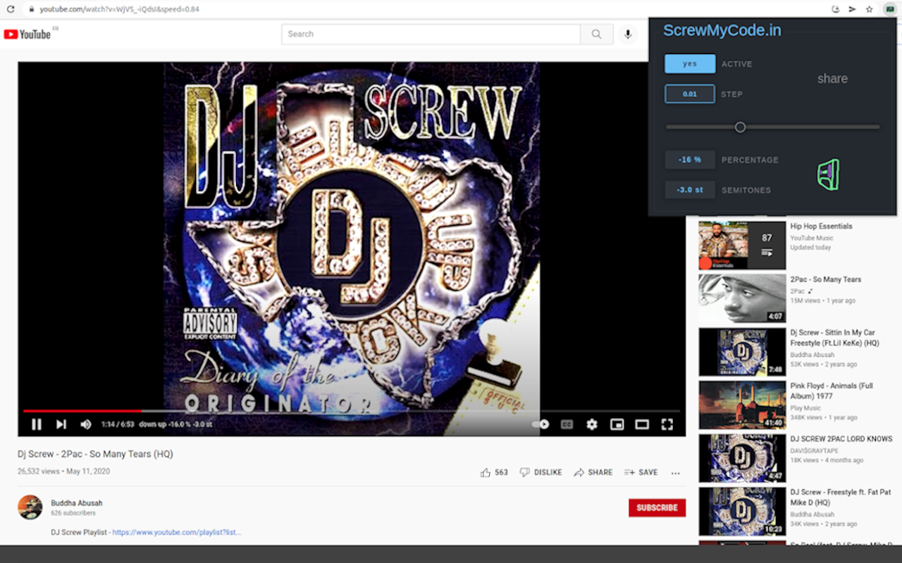

[ScrewMyCode.in](https://www.screwmycode.in/): Pitch control for <a href="https://www.youtube.com/">YouTube</a>



## 🚀 Download

[ **Firefox**](https://addons.mozilla.org/firefox/addon/screwmycode-in/)

## 📖 Description

Slow down and speed up videos directly on YouTube like you would on a turntable.

### ⚙️ Use either

- Popup settings
- Embedded controls

### 📣 Share to

- Users of the extension with the dynamic YouTube URL
- Other users through the dedicated website [ScrewMyCode.in](https://www.screwmycode.in/)

## 🖊 Contribute

```bash
git clone https://github.com/bamdadsabbagh/screwmycode-in--extension.git
cd screwmycode-in--extension
yarn

# with Chrome
yarn dev:chrome

# with Firefox
yarn dev:firefox
```
